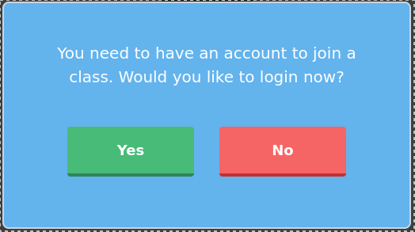
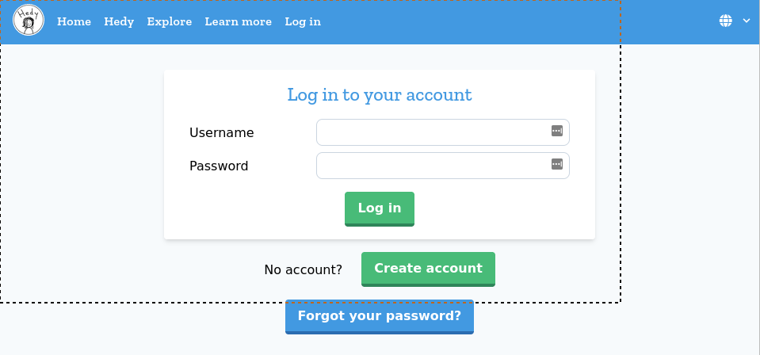

# Gentle Hands-on Introduction Programming

Teaching materials for the course. This course is intended to help new
programmers find their feet and begin them on their journeyto writing
useful programs.

## Outline

1. _Introduction_: We begin with [Hedy](https://hedy.org), a _gradual_ introduction to programming. This
   aids in learning to think computationally. But also builds confidence and provides quick
   feedback between writing a program and seeing outp[ut on the screen. Finally, it motivates
   syntax (especially for strings).
2. Data types: introduces the concept and value of types and the Python syntax for data type annotations.
3. Functions: introduces functions as an abstraction for program design and construction.
   Testing is also covered. This chapter forms the final theoretical foundation for the course.
4. Decisions: `if`, `elif`, and `else`.
5. Collections: lists, operations on lists, `in`.
6. Loops: `for`-each loops over lists, stings, and `reange()`.
7. Dictionaries: associating data, looping, slicing, and other operations.
8. Input and output: dealing with the outside world. Data cleaning and some common
   file formats in bioinformatics, such as csv and fasta, are covered.
9. Plotting: a teaser for more advanced topics.

## Hedy

As part of your welcome email you should receive a link to join Hedy. When you click on the link you should see
a website asking if you want to join the class.

When you click on the "Join class" button you will be prompted to create an account. Click "Yes".

You will then be asked to login using a username and password. If you do not already have an account you can
click on the "Create account" button.

You will now be asked if you are a student or a teacher. You should click "Student".

At this point you have successfully created your account and joined the class.

