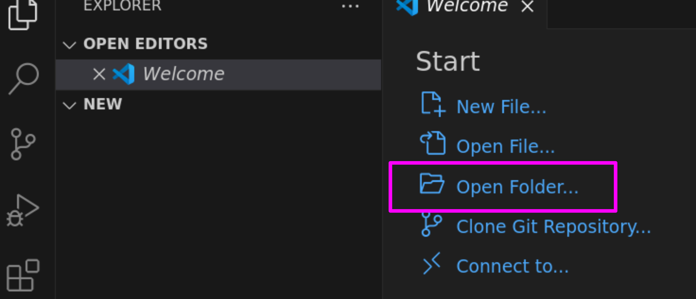
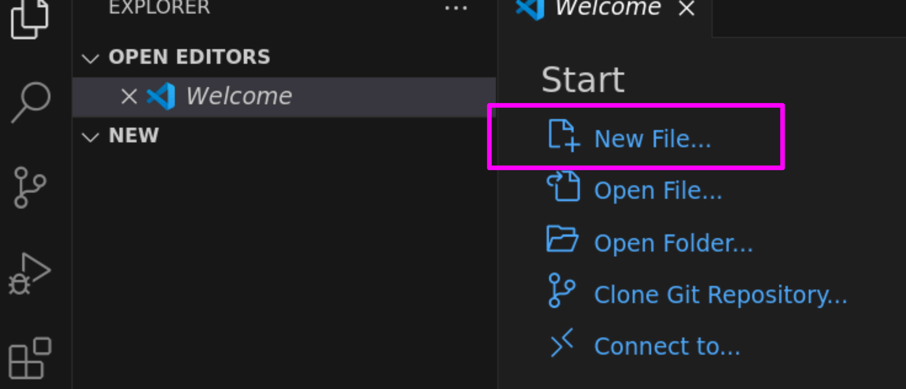
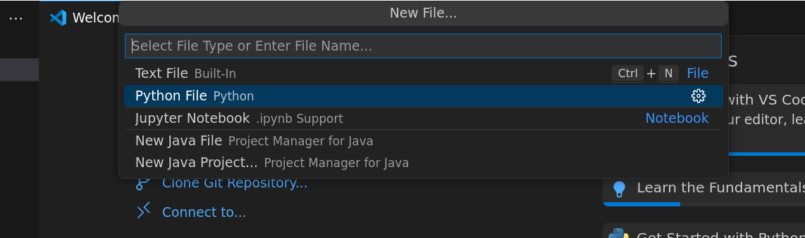

# Development environment

So far during this course you have been using a simple editing window in Dodona (and Hedy) to edit and
run your programs. This is what programmers call a development environment. It provides all of the
tools necessary to edit, run, and debug your code.

After this course however, you will need to edit, run, and debug code without using Dodona. So lets
set up a more "realistic" development environment on your computer now. You will install VSCodium,
an open-source version of VSCode. This is a professional Integrated Development Environment that is
very popular at the moment. If you're interested in Notebooks, you can even run and edit notebooks
in VSCodium.

## Warning

If you're using a computer supplied by IT services that prevents you from installing software, or if
you have any trouble installing any software then you can continue to follow along with the course
as you already have been doing. You do not need a local development environment now. It is useful
for the future, but when you need it you can come back here if you wish.

## Set up

<iframe width="560" height="315" src="https://www.youtube-nocookie.com/embed/vLRAUHpeHtM?si=PxtopmEcQ6Qj03_U" title="YouTube video player" frameborder="0" allow="accelerometer; autoplay; clipboard-write; encrypted-media; gyroscope; picture-in-picture; web-share" referrerpolicy="strict-origin-when-cross-origin" allowfullscreen></iframe>
 
## Getting started

You can create a new folder for your Python scripts somewhere on your computer, then use VSCodium to
"Open folder" where you created that new folder...



Now you can start a new python script to check that you've set everything up correctly. Start by
creating a new Python file like this...



Then, at the prompt, select "Python file", like this...



Type in a simple test script like this:

```python
print("My development environment is working!")
```

Then save the file. When you save the file, you'll be prompted for a name. Use a simple name ending
in `.py`. Something like `main.py` is perfect.

Now you can run your script by pressing the play button in the top-left of the vscodium window. You
should see the text you typed printed in the console.


## Dodona

You will still submit exercise solutions on Dodona. But from now on you're welcome to edit your
solutions in vscodium.
