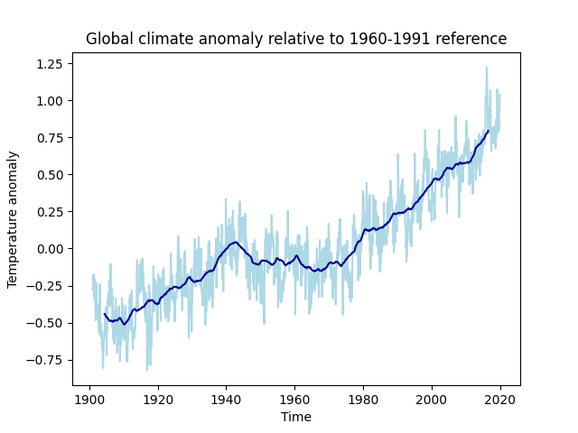
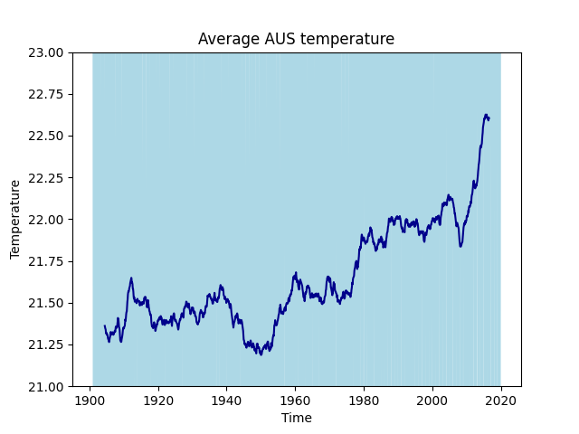
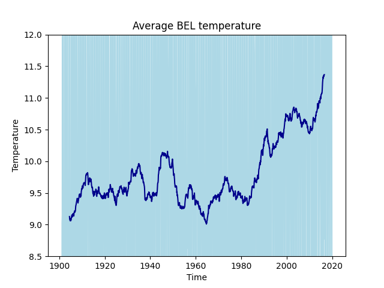
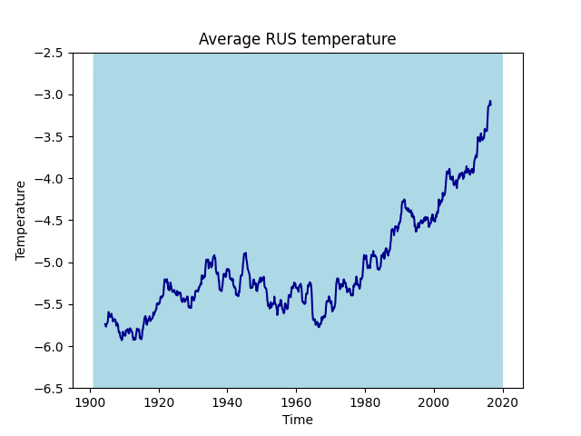

** YOU CANNOT SUBMIT THIS EXERCISE ON DODONA**
This exercise is not used to score you. Feel welcome to complete it on your own.

Create a plot of the global temperature anomaly in a function called `plot_global_data`. Include
the un-smoothed and smoothed data in a line plot. Label axes and include a plot title.

## Smoothing

The plot in the last exercise was very noisy, hard to distinguish a general pattern. By averaging
the observations in a moving window (smoothing [^1] the data), you can more easily distinguish
a pattern in the data.

So you will need to write functions that will extract a moving window, average the temperature
observations within each window, then plot the result.

When drawing this plot, your result should look like this:

Experiment with adding and changing line colours with the `color` parameter.

When you have completed this for the global data, repeat for the per-country data. You may want to
limit the range of the y-axis so that you can see the data (you can use the `ylim` function for
this).

## Australia

## Belgium

## Russia

[^1]: [Data smoothing](https://www.climate4you.com/DataSmoothing.htm)

## Supporting material

* [Become a Python Data Analyst](https://www.packtpub.com/eu/big-data-and-business-intelligence/become-python-data-analyst)
* [Add confidence interval on barplot](https://python-graph-gallery.com/8-add-confidence-interval-on-barplot/)
* [Matplotlib Cheatsheets](https://github.com/matplotlib/cheatsheets#cheatsheets)
